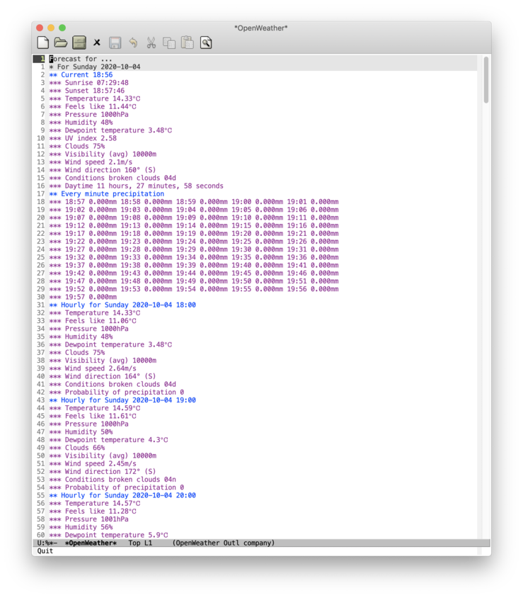
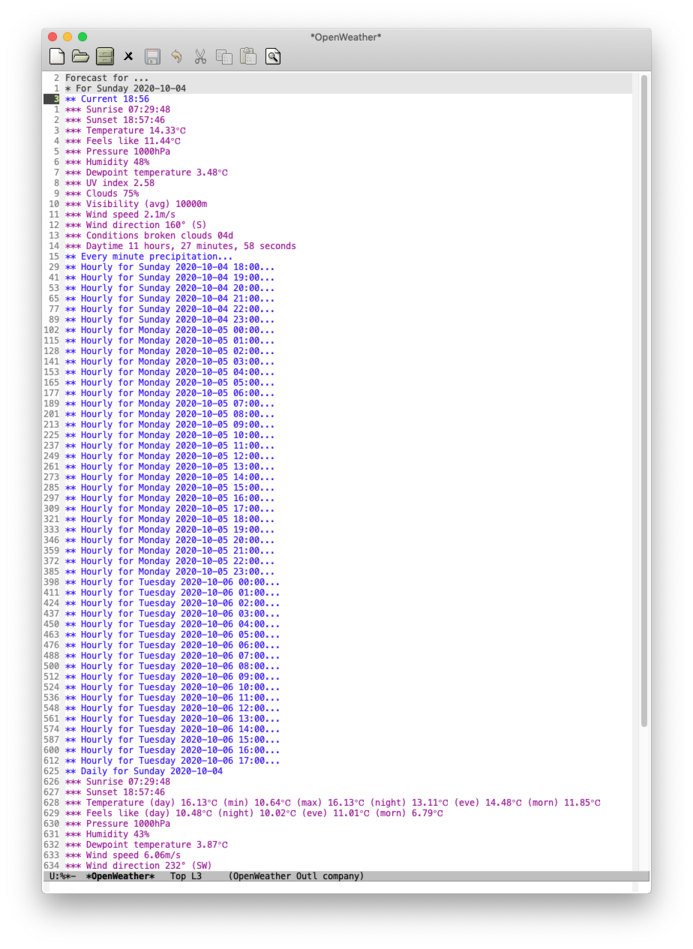

#  openweather-el: Weather data from OpenWeather in Emacs

An Emacs package for displaying current and forecast weather data from
[OpenWeatherMap](https://openweathermap.org/).



## Installation

Clone this repository and add `openweather-el` directory to your `load-path`.
```cl
(add-to-list 'load-path "path/to/openweather-el")
(require 'openweather)
```
Configure your location by setting the variables `openweather-location-name`,
`openweather-location-latitude`, and `openweather-location-longitude`.
```cl
(setq openweather-location-name "..."
      openweather-location-latitude 50.00
      openweather-location-longitude 10.00)
```
Set the variable `openweather-appid`. You need to create a free
[OpenWeatherMap](https://www.openweathermap.org) account. Your API key will be available at
[https://home.openweathermap.org/api_keys](https://home.openweathermap.org/api_keys)
(URL requires login).
```cl
(setq openweather-appid "API-KEY-HERE")
```
A few other configurations options are available, see the configuration group called `openweather`.

## Usage

To display the forecast for your location, call `M-x openweather-update`.

Two key mappings are available within the forecast window:

* `g` - Update the contents of the \***OpenWeather**\* buffer.
* `q` - Kill the buffer and close the window.

The \***OpenWeather**\* buffer enables the [outline-minor-mode](http://wikemacs.org/wiki/Outline)
which allows to hide and show text in an Emacs buffer under heading lines starting with one or
more asterisk ('`*`') characters (c.f. the folding behavior in Org mode). To perform folding of
heading lines in the \***OpenWeather**\* simply invoke the key bindings from `outline-minor-mode`.



If you want to have *visibility cycling* like in Org mode, i.e. a *single* command to replace the
many outline commands for showing and hiding parts of a document, include
[outline-magic](http://staff.science.uva.nl/~dominik/Tools/outline-magic.el) to your `load-path`.
Then add the following to your `.emacs` file
```cl
(add-hook 'outline-minor-mode-hook
          (lambda ()
            (require 'outline-magic)
            (define-key outline-minor-mode-map (kbd "TAB") 'outline-cycle)))
```

## License

This program is not part of GNU Emacs.

This program is free software; you can redistribute it and/or modify it under the terms of the
GNU General Public License as published by the Free Software Foundation; either version 2, or (at
your option) any later version.

This file is distributed in the hope that it will useful, but WITHOUT ANY WARRANTY; without even the
implied warranty of MERCHANTABILITY or FITNESS FOR A PARTICULAR PURPOSE. See the GNU General Public
License for more details.
